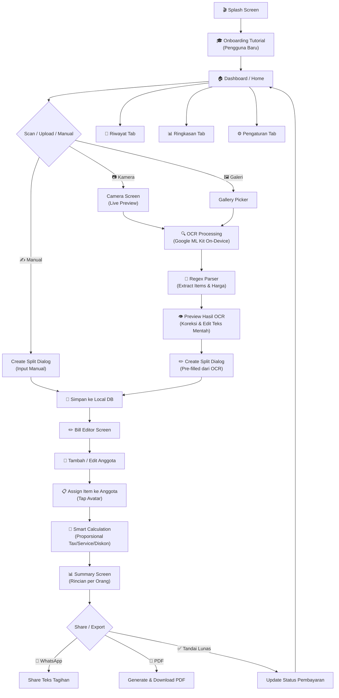

<p align="center">
  
</p>

<h1 align="center">Neobill — Split Bill Cerdas dengan OCR 🧾⚡</h1>

<p align="center">
  <em>Hitung Cepat, Split Adil — Bayar Tanpa Ribet!</em>
</p>

<p align="center">
  
  
  
  
  
  
</p>

---

## 📖 Daftar Isi

- [Tentang Proyek](#-tentang-proyek)
- [Masalah yang Diselesaikan](#-masalah-yang-diselesaikan)
- [Fitur Utama](#-fitur-utama)
- [Screenshot & Tampilan](#-screenshot--tampilan)
- [Alur Aplikasi (Flow)](#-alur-aplikasi-flow)
- [Arsitektur & Struktur Folder](#-arsitektur--struktur-folder)
- [Tech Stack & Bahasa Pemrograman](#-tech-stack--bahasa-pemrograman)
- [Dependencies & Package](#-dependencies--package)
- [Design System](#-design-system--neo-brutalism)
- [Cara Install & Menjalankan](#-cara-install--menjalankan)
- [Konfigurasi Platform](#-konfigurasi-platform)
- [Kontributor](#-kontributor)

---

## 🎯 Tentang Proyek

**Neobill** (sebelumnya **FairSplit**) adalah aplikasi mobile Flutter yang memudahkan proses **split bill / patungan** secara adil dan proporsional. Aplikasi ini memanfaatkan teknologi **OCR (Optical Character Recognition)** berbasis **Google ML Kit** untuk membaca struk belanja secara otomatis — mendeteksi nama item dan harga tanpa perlu input manual.

> **Tagline:** *"Hitung Cepat, Split Adil ⚡"*

Aplikasi ini dirancang khusus untuk kebutuhan sehari-hari pengguna Indonesia yang sering makan bersama teman, keluarga, atau rekan kerja dan perlu membagi tagihan secara akurat.

---

## 🔥 Masalah yang Diselesaikan

| Masalah | Solusi Neobill |
|---|---|
| Menghitung split bill secara manual itu ribet dan rawan salah | Kalkulasi otomatis proporsional (pajak, service, diskon dibagi adil) |
| Input item satu per satu dari struk sangat makan waktu | **OCR Scan** — foto struk, item & harga langsung terbaca |
| Pajak/service charge sering tidak dibagi adil (rata-rata) | Pembagian **proporsional** berdasarkan subtotal masing-masing orang |
| Sulit melacak siapa yang sudah bayar dan siapa yang belum | **Status pelunasan** per anggota (Lunas / Belum Bayar) |
| Tidak ada bukti tagihan yang bisa dikirim ke teman | **Share ke WhatsApp** & **Export PDF** rincian tagihan per orang |
| Struk asing (USD/SGD/JPY/EUR) susah dikonversi | **Auto-detect mata uang** dari struk + konversi kurs real-time |

---

## ✨ Fitur Utama

### 📷 1. AI Smart Scanner (OCR)
- **Scan struk** langsung dari kamera atau galeri foto
- **On-Device OCR** menggunakan Google ML Kit Text Recognition — tidak perlu internet untuk proses scan
- **Regex Parser canggih** mendukung berbagai format struk Indonesia:
  - Satu baris: `Kopi Susu 28.000`
  - Format qty: `2x Roti Bakar 30.000`
  - Format Rp: `Ayam Bakar Rp 35.000`
  - Struk thermal: nama & harga di baris terpisah
  - Struk dengan titik penghubung: `Nasi Goreng.......20.000`
  - Format dua kolom (Pawoon POS, dll.)
- **Preview & koreksi** hasil OCR sebelum disimpan
- **Edit teks mentah** OCR dan parse ulang bila ada salah baca
- **Auto-detect mata uang asing** (USD, SGD, JPY, EUR) dari teks struk

### ✏️ 2. Bill Editor (Edit Struk & Pesanan)
- **CRUD Item**: tambah, edit, hapus item pesanan
- **Stepper kuantitas**: `[-] [1] [+]` untuk mengatur jumlah pesanan
- **Toggle pajak**: PPN 11% dan Service Charge 10% (bisa di-on/off)
- **Auto-recalculate**: total otomatis berubah saat item/qty/pajak diubah
- **Format harga otomatis**: input `35000` → tampil `Rp 35.000`

### 👥 3. Member Assignment (Pembagian Pesanan)
- **Tambah anggota** dengan nama dan warna unik (avatar otomatis)
- **Assign item ke anggota**: tap avatar pada setiap item untuk menandai siapa yang memesan
- **Shared items**: 1 item yang dipesan bersama otomatis dibagi rata ke anggota terpilih
- **Visual chips**: avatar anggota tampil langsung pada kartu item yang sudah di-assign
- **Warna pastel unik** per anggota (Kuning, Teal, Orange, Purple, dll.)

### 🧮 4. Smart Calculation (Kalkulasi Cerdas)
- **Pembagian proporsional**:
  ```
  taxPortion[i]     = (subtotalPerson[i] / totalSubtotal) × totalTax
  servicePortion[i] = (subtotalPerson[i] / totalSubtotal) × totalService
  discountPortion[i] = (subtotalPerson[i] / totalSubtotal) × totalDiscount
  ```
- **Largest Remainder Method** (metode sisa terbesar): pembulatan ke rupiah utuh tanpa selisih — jumlah tagihan semua member **selalu tepat sama** dengan total tagihan
- Item tanpa assign otomatis dibagi rata ke semua member

### 📊 5. Ringkasan & Summary
- **Breakdown per anggota**: subtotal item, porsi pajak, porsi diskon, **Grand Total**
- **Status pelunasan**: toggle Lunas / Belum Bayar per anggota
- **Progress pembayaran**: `3/4 Anggota Transfer`
- **Verifikasi total**: grand total seluruh anggota = total tagihan struk

### 📱 6. Share & Export
- **Share ke WhatsApp**: teks rincian tagihan per orang yang siap kirim
- **Export PDF**: generate dokumen PDF struk lengkap dengan rincian pembagian
- **URL Launcher**: integrasi langsung dengan WhatsApp dan aplikasi berbagi lainnya

### 🏠 7. Dashboard Interaktif
- **Greeting personal** berdasarkan waktu (Pagi/Siang/Malam)
- **Search bar**: cari struk berdasarkan nama resto, kategori, atau nama anggota
- **Split Aktif**: kartu horizontal berwarna-warni menampilkan split yang sedang berjalan
- **Featured Split Card**: kartu utama dengan badge status, statistik ringkas (Total, Items, Status)
- **Grafik pengeluaran**: chart tren 6 bulan terakhir & pie chart kategori pengeluaran (real-time)

### 📜 8. Riwayat Transaksi
- **Tab filter**: Semua / Lunas / Pending
- **Search riwayat**: pencarian cepat transaksi lama
- **Detail lengkap**: tanggal, total, jumlah anggota, status per transaksi

### ⚙️ 9. Pengaturan Lengkap
- **Multi-mata uang**: IDR, USD, SGD (dengan format yang sesuai)
- **Multi-bahasa**: Bahasa Indonesia & English
- **Dark Mode**: tema gelap penuh dengan palet warna yang disesuaikan
- **Kurs mata uang real-time**: update otomatis dari API (open.er-api.com)
- **Manajemen database**: bersihkan data / muat data demo
- **Tutorial in-app**: panduan interaktif untuk pengguna baru

### 🎓 10. Onboarding & Tutorial
- **Splash screen** animasi dengan Lottie
- **Feature tutorial overlay**: highlight elemen UI utama (kamera, tab navigasi) langsung di dalam aplikasi
- **Tutorial versi**: otomatis tampil saat ada update konten tutorial

---

## 🖼 Screenshot & Tampilan

Aplikasi menggunakan gaya desain **Soft Neo-Brutalism** yang khas:
- Border hitam tegas (2.5px)
- Hard offset shadow tanpa blur
- Palet warna pastel cerah (Kuning, Teal, Orange, Lavender)
- Sudut membulat (rounded corners 16-24px)

```
┌───────────────────────────────────────────────┐
│  🏠 Dashboard    │  📷 Scanner    │  ✏️ Editor  │
├───────────────────┼────────────────┼────────────┤
│  Greeting +       │  Camera Frame  │  List Items │
│  Search Bar       │  Scan Line     │  Qty +-     │
│  Split Aktif      │  Controls      │  Tax Toggle │
│  Featured Card    │  Gallery/Flash │  Members    │
│  Charts           │                │  Assignment │
├───────────────────┼────────────────┼────────────┤
│  📊 Summary      │  📜 History    │  ⚙️ Settings│
├───────────────────┼────────────────┼────────────┤
│  Per-Person Card  │  Tab Filters   │  Currency   │
│  Status Toggle    │  Search        │  Language   │
│  Share WhatsApp   │  Transaction   │  Dark Mode  │
│  Export PDF       │  Cards         │  Database   │
└───────────────────┴────────────────┴────────────┘
```

---

## 🔄 Alur Aplikasi (Flow)



### Detail Flow Step-by-Step:

1. **Launch App** → Splash screen animasi Lottie → cek tutorial status
2. **Onboarding** → Tutorial interaktif highlight tombol kamera & navigasi (pengguna baru)
3. **Dashboard** → Lihat split aktif, grafik pengeluaran, struk terbaru
4. **Scan Struk** → Buka kamera / pilih dari galeri → OCR memproses gambar
5. **Review OCR** → Preview item & harga yang terbaca → koreksi manual jika perlu
6. **Buat Split** → Isi nama struk, kategori, tambah anggota
7. **Edit Bill** → Tambah/hapus/edit item, atur qty, toggle pajak/service
8. **Assign Item** → Tap avatar anggota pada setiap item pesanan
9. **Kalkulasi** → Sistem menghitung otomatis secara proporsional
10. **Summary** → Lihat rincian tagihan per orang
11. **Share** → Kirim ke WhatsApp atau export PDF
12. **Pelunasan** → Tandai anggota yang sudah bayar

---

## 🏗 Arsitektur & Struktur Folder

Proyek ini menggunakan arsitektur **Feature-First** dengan pemisahan yang jelas:

```
lib/
├── main.dart                          # Entry point aplikasi
├── main_navigation.dart               # Bottom navigation & routing antar screen
│
├── core/                              # Layer inti (dipakai seluruh fitur)
│   ├── data/
│   │   └── demo_splits.dart           # Data demo / contoh struk
│   ├── database/
│   │   └── local_database_service.dart # SharedPreferences / JSON storage
│   ├── models/
│   │   └── split_model.dart           # Model data: SplitBill, Member, ReceiptItem
│   ├── settings/
│   │   └── settings_service.dart      # Singleton preferensi (currency, dark mode, language)
│   ├── state/
│   │   └── split_store.dart           # State management (ChangeNotifier)
│   ├── theme/
│   │   ├── app_colors.dart            # Design tokens & color palette
│   │   └── app_theme.dart             # Material 3 light/dark theme
│   └── utils/
│       ├── app_l10n.dart              # Localization (ID & EN) — 200+ string
│       ├── app_snackbar.dart          # Utility snackbar Neo-Brutalist
│       ├── category_guesser.dart      # Auto-guess kategori dari nama struk
│       ├── currency_formatter.dart    # Format Rp / $ / S$ & parse harga
│       ├── currency_rates.dart        # Kurs mata uang asing ↔ IDR (API real-time)
│       ├── date_formatter.dart        # Format tanggal Indonesia
│       ├── ocr_error.dart             # Error handling khusus OCR
│       └── receipt_parser.dart        # ⭐ Regex engine OCR → List<ReceiptItem>
│
├── features/                          # Fitur-fitur utama
│   ├── splash/
│   │   └── screens/
│   │       └── splash_screen.dart     # Splash screen + loading animasi Lottie
│   ├── onboarding/
│   │   └── widgets/
│   │       └── feature_tutorial_overlay.dart  # Tutorial interaktif in-app
│   ├── dashboard/
│   │   └── screens/
│   │       └── dashboard_screen.dart  # Home: split aktif, chart, featured card
│   ├── ocr_scanner/
│   │   ├── screens/
│   │   │   └── scanner_screen.dart    # Kamera, galeri, OCR preview
│   │   └── services/
│   │       └── ocr_service.dart       # Wrapper Google ML Kit
│   ├── bill_editor/
│   │   └── screens/
│   │       ├── bill_editor_screen.dart    # Edit item, member, assignment
│   │       └── create_split_dialog.dart   # Dialog buat split baru / manual
│   ├── ringkasan/
│   │   └── screens/
│   │       └── ringkasan_screen.dart  # Summary per orang, share, PDF
│   ├── riwayat/
│   │   └── screens/
│   │       └── riwayat_screen.dart    # History list + filter + search
│   └── pengaturan/
│       └── screens/
│           └── pengaturan_screen.dart # Settings: currency, lang, dark, DB
│
└── shared/                            # Komponen UI yang dipakai ulang (reusable)
    └── widgets/
        ├── neo_avatar.dart            # Avatar lingkaran Neo-Brutalist
        ├── neo_bottom_sheet.dart       # Bottom sheet dengan border tegas
        ├── neo_button.dart            # Tombol pill CTA (kuning/teal/dll.)
        ├── neo_card.dart              # Kartu container dengan offset shadow
        ├── neo_chip.dart              # Chip/badge anggota berwarna
        ├── neo_confirm_dialog.dart    # Dialog konfirmasi Neo-Brutalist
        ├── neo_input.dart             # Input field dengan border tegas
        ├── neo_line_chart.dart        # Grafik garis tren pengeluaran
        ├── neo_lottie_loader.dart     # Loading animasi Lottie
        ├── neo_paw_logo.dart          # Logo animasi
        ├── neo_pie_chart.dart         # Pie chart kategori pengeluaran
        ├── neo_search_bar.dart        # Search bar pill Neo-Brutalist
        └── neo_shimmer_skeleton.dart  # Skeleton loading shimmer effect
```

---

## 💻 Tech Stack & Bahasa Pemrograman

### Bahasa Pemrograman

| Bahasa | Versi | Kegunaan |
|---|---|---|
| **Dart** | ^3.12.2 | Bahasa utama seluruh logic, model, state, dan UI |
| **YAML** | — | Konfigurasi proyek (`pubspec.yaml`, `analysis_options.yaml`) |
| **XML** | — | Konfigurasi Android (`AndroidManifest.xml`) |
| **Swift / Obj-C** | — | Konfigurasi iOS native |

### Framework & Tools

| Komponen | Teknologi | Keterangan |
|---|---|---|
| **UI Framework** | Flutter 3.x | Cross-platform (Android & iOS) |
| **State Management** | `ChangeNotifier` + `ListenableBuilder` | Lightweight, tanpa library eksternal |
| **Navigation** | `IndexedStack` + custom state | Bottom navigation dengan floating center button |
| **Local Storage** | `SharedPreferences` + JSON | Penyimpanan data offline ringan |
| **OCR Engine** | Google ML Kit Text Recognition | On-device, tanpa internet untuk proses scan |
| **Camera** | `camera` package | Live preview kamera |
| **Image Picker** | `image_picker` package | Pilih gambar dari galeri |
| **PDF Generator** | `pdf` + `printing` | Generate & print/download PDF |
| **HTTP Client** | `http` package | Fetch kurs mata uang dari API |
| **Typography** | Google Fonts (`Outfit`, `Plus Jakarta Sans`) | Font premium & modern |
| **Animation** | `Lottie` | Animasi splash, loading, scan |
| **Shimmer** | `shimmer` package | Loading skeleton effect |
| **Localization** | Custom `app_l10n.dart` | Bahasa Indonesia & English (200+ string) |
| **Currency API** | open.er-api.com (gratis, tanpa key) | Kurs real-time USD, SGD, JPY, EUR → IDR |

---

## 📦 Dependencies & Package

### Production Dependencies

```yaml
dependencies:
  flutter: sdk
  cupertino_icons: ^1.0.8        # iOS-style icons
  google_fonts: ^8.2.1           # Font Outfit & Plus Jakarta Sans
  intl: ^0.20.3                  # Format tanggal & angka (locale id_ID)
  lottie: ^3.3.1                 # Animasi Lottie (splash, loading)
  shared_preferences: ^2.5.2     # Local key-value storage
  camera: ^0.12.0+2              # Akses kamera live
  google_mlkit_text_recognition: ^0.16.0  # OCR on-device
  image_picker: ^1.2.3           # Pilih gambar galeri
  url_launcher: ^6.3.2           # Buka WhatsApp / URL eksternal
  pdf: ^3.13.0                   # Generate dokumen PDF
  printing: ^5.15.0              # Preview & print/save PDF
  http: ^1.5.0                   # HTTP client (fetch kurs)
  shimmer: ^3.0.0                # Shimmer skeleton loading
```

### Dev Dependencies

```yaml
dev_dependencies:
  flutter_test: sdk              # Unit & widget testing
  flutter_lints: ^6.0.0          # Linting rules
  integration_test: sdk          # Integration testing
  flutter_launcher_icons: ^0.14.4 # Generate app icon
```

---

## 🎨 Design System — Neo-Brutalism

Neobill menggunakan gaya desain **Soft Neo-Brutalism** yang unik dan eye-catching:

### Color Palette

| Token | Hex | Kegunaan |
|---|---|---|
| `bgCream` | `#FAF6EE` | Background utama |
| `cardWhite` | `#FFFFFF` | Background kartu |
| `borderBlack` | `#1E1E1E` | Border 2.5px & offset shadow |
| `accentYellow` | `#FFCD00` | 💛 CTA utama, card aktif |
| `accentTeal` | `#2DD4BF` | 🩵 Status selesai, card anggota |
| `accentOrange` | `#FF7A59` | 🧡 Badge kategori, card anggota |
| `accentLavender` | `#A5B4FC` | 💜 Badge tambahan, filter aktif |
| `accentGreen` | `#22C55E` | 💚 Status lunas |
| `accentRed` | `#F87171` | 🔴 Belum bayar, hapus |

### Elemen Khas

- **Border**: `2.5px` solid `#1E1E1E`
- **Shadow**: `Offset(3, 3)` tanpa blur (hard shadow 2D)
- **Border Radius**: Card `20px`, Button `30px`, Chip `12-50px`
- **Font**: `Outfit` (headline) + `Plus Jakarta Sans` (body)
- **Dark Mode**: Palet warna gelap lengkap yang menyesuaikan semua token

### Komponen UI Reusable

| Widget | Deskripsi |
|---|---|
| `NeoCard` | Kartu container dengan border & offset shadow |
| `NeoButton` | Tombol pill CTA (berbagai warna) |
| `NeoAvatar` | Avatar lingkaran dengan border tegas |
| `NeoChip` | Chip/badge warna pastel |
| `NeoInput` | Input field dengan border Neo-Brutalist |
| `NeoSearchBar` | Search bar pill memanjang |
| `NeoBottomSheet` | Bottom sheet dengan border tegas |
| `NeoConfirmDialog` | Dialog konfirmasi styled |
| `NeoLineChart` | Chart garis tren pengeluaran |
| `NeoPieChart` | Pie chart kategori pengeluaran |
| `NeoShimmerSkeleton` | Loading skeleton dengan shimmer effect |
| `NeoLottieLoader` | Loading animasi Lottie |

---

## 🚀 Cara Install & Menjalankan

### Prasyarat

- **Flutter SDK** ≥ 3.12.2
- **Dart SDK** ≥ 3.12.2
- **Android Studio** / **VS Code** dengan Flutter extension
- **Android SDK** (min SDK 21) atau **Xcode** (untuk iOS)

### Langkah-Langkah

```bash
# 1. Clone repository
git clone https://github.com/Falzz1010/split_bill.git
cd split_bill

# 2. Install dependencies
flutter pub get

# 3. Generate app icon (opsional)
flutter pub run flutter_launcher_icons

# 4. Jalankan di emulator/device
flutter run

# 5. Build APK Release
flutter build apk --release

# 6. Build iOS (memerlukan macOS)
flutter build ios --release
```

### Menjalankan Test

```bash
# Static analysis
flutter analyze

# Unit tests
flutter test

# Integration tests
flutter test integration_test/
```

---

## 📱 Konfigurasi Platform

### Android
- **Min SDK**: 21 (Android 5.0 Lollipop)
- **Permissions**: Kamera, Internet, Storage
- **Adaptive Icon**: Background kuning `#FFCD00` dengan foreground custom

### iOS
- **Camera Usage Description**: Diperlukan untuk scan struk
- **Photo Library Usage Description**: Diperlukan untuk upload struk dari galeri

---

## 🌟 Manfaat Aplikasi

### Untuk Pengguna Sehari-hari
- ⏱️ **Hemat waktu** — scan struk dalam 3 detik, tidak perlu input manual
- ✅ **Akurasi tinggi** — perhitungan proporsional tanpa selisih (metode sisa terbesar)
- 🤝 **Adil** — pajak, service charge, dan diskon dibagi sesuai porsi masing-masing
- 📱 **Praktis** — langsung share tagihan via WhatsApp atau PDF
- 🔒 **Offline-first** — data tersimpan lokal, OCR berjalan on-device tanpa internet
- 🌙 **Nyaman** — dark mode untuk penggunaan malam hari
- 🌐 **Multi-bahasa** — Indonesia & English
- 💱 **Multi-mata uang** — scan struk asing otomatis konversi ke IDR

### Untuk Developer
- 📐 **Arsitektur bersih** — feature-first structure yang mudah di-maintain
- 🎨 **Design system konsisten** — Neo-Brutalism widget library yang reusable
- 🧪 **Testable** — unit test & integration test siap pakai
- 📖 **Well-documented** — komentar code dalam Bahasa Indonesia yang detail
- ⚡ **Lightweight** — tanpa BLoC/Riverpod, cukup `ChangeNotifier` yang ringan

---

## 🤝 Kontributor

| Nama | Role |
|---|---|
| **Falzz1010** | Creator & Developer |

---

## 📝 Lisensi

Proyek ini bersifat **private** dan tidak dipublikasikan ke pub.dev.

---

<p align="center">
  <strong>Neobill — Split Bill Cerdas dengan OCR 🧾⚡</strong><br/>
  <em>Dibuat dengan ❤️ menggunakan Flutter & Dart</em>
</p>
