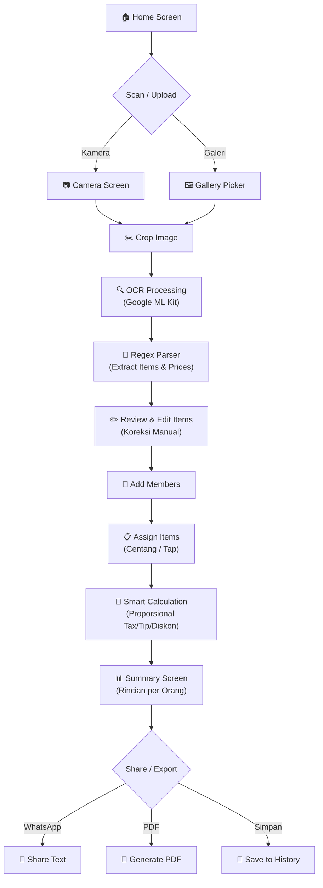
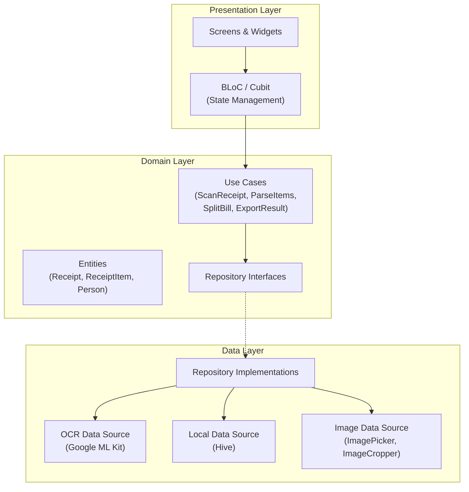

# FairSplit — Split Bill + OCR Struk Belanja (Flutter)

Aplikasi mobile Flutter yang memanfaatkan kamera & On-Device OCR (Google ML Kit) untuk scan struk belanja, parsing otomatis nama item & harga, assign pesanan ke teman, dan kalkulasi split bill secara proporsional (pajak, service charge, diskon).

## Flow Diagram



## Arsitektur Clean Architecture



## Proposed Changes

### Struktur Folder Lengkap

```
lib/
├── main.dart
├── app.dart
├── core/
│   ├── theme/
│   │   ├── app_theme.dart              # Material 3 theme config
│   │   └── app_colors.dart             # Color palette
│   ├── constants/
│   │   └── app_constants.dart          # App-wide constants
│   ├── utils/
│   │   ├── currency_formatter.dart     # Rp formatting
│   │   └── receipt_parser.dart         # Regex parser OCR -> Items
│   └── router/
│       └── app_router.dart             # GoRouter navigation
│
├── features/
│   ├── ocr_scanner/
│   │   ├── data/
│   │   │   ├── datasources/
│   │   │   │   └── ocr_data_source.dart
│   │   │   └── repositories/
│   │   │       └── ocr_repository_impl.dart
│   │   ├── domain/
│   │   │   ├── entities/
│   │   │   │   └── ocr_result.dart
│   │   │   ├── repositories/
│   │   │   │   └── ocr_repository.dart
│   │   │   └── usecases/
│   │   │       └── scan_receipt.dart
│   │   └── presentation/
│   │       ├── bloc/
│   │       │   ├── ocr_bloc.dart
│   │       │   ├── ocr_event.dart
│   │       │   └── ocr_state.dart
│   │       └── screens/
│   │           └── scanner_screen.dart
│   │
│   ├── bill_editor/
│   │   ├── data/
│   │   │   └── repositories/
│   │   │       └── bill_repository_impl.dart
│   │   ├── domain/
│   │   │   ├── entities/
│   │   │   │   ├── receipt.dart
│   │   │   │   └── receipt_item.dart
│   │   │   ├── repositories/
│   │   │   │   └── bill_repository.dart
│   │   │   └── usecases/
│   │   │       └── calculate_bill.dart
│   │   └── presentation/
│   │       ├── bloc/
│   │       │   ├── bill_editor_bloc.dart
│   │       │   ├── bill_editor_event.dart
│   │       │   └── bill_editor_state.dart
│   │       ├── screens/
│   │       │   └── bill_editor_screen.dart
│   │       └── widgets/
│   │           ├── item_card.dart
│   │           └── add_item_dialog.dart
│   │
│   ├── split_assignment/
│   │   ├── domain/
│   │   │   ├── entities/
│   │   │   │   ├── person.dart
│   │   │   │   └── split_result.dart
│   │   │   └── usecases/
│   │   │       └── split_bill.dart
│   │   └── presentation/
│   │       ├── bloc/
│   │       │   ├── split_bloc.dart
│   │       │   ├── split_event.dart
│   │       │   └── split_state.dart
│   │       ├── screens/
│   │       │   ├── member_screen.dart
│   │       │   └── assignment_screen.dart
│   │       └── widgets/
│   │           ├── person_chip.dart
│   │           └── assignment_card.dart
│   │
│   ├── summary/
│   │   └── presentation/
│   │       ├── bloc/
│   │       │   ├── summary_bloc.dart
│   │       │   ├── summary_event.dart
│   │       │   └── summary_state.dart
│   │       ├── screens/
│   │       │   └── summary_screen.dart
│   │       └── widgets/
│   │           └── person_summary_card.dart
│   │
│   └── history/
│       ├── data/
│       │   ├── datasources/
│       │   │   └── local_data_source.dart
│       │   ├── models/
│       │   │   └── receipt_hive_model.dart
│       │   └── repositories/
│       │       └── history_repository_impl.dart
│       ├── domain/
│       │   ├── repositories/
│       │   │   └── history_repository.dart
│       │   └── usecases/
│       │       ├── save_history.dart
│       │       └── get_history.dart
│       └── presentation/
│           ├── bloc/
│           │   ├── history_bloc.dart
│           │   ├── history_event.dart
│           │   └── history_state.dart
│           ├── screens/
│           │   └── history_screen.dart
│           └── widgets/
│               └── history_card.dart
│
└── shared/
    └── widgets/
        ├── custom_button.dart
        └── loading_overlay.dart
```

---

### 1. Project Setup & Core

#### [NEW] `pubspec.yaml`
- Flutter SDK, dependencies: `flutter_bloc`, `equatable`, `go_router`, `image_picker`, `image_cropper`, `google_mlkit_text_recognition`, `hive`, `hive_flutter`, `path_provider`, `share_plus`, `pdf`, `printing`, `intl`, `uuid`, `google_fonts`
- Platform configs for kamera & file access

#### [NEW] `lib/main.dart`
- Hive initialization, app bootstrap

#### [NEW] `lib/app.dart`
- MaterialApp.router dengan GoRouter & Material 3 theme

#### [NEW] `lib/core/theme/app_theme.dart` & `app_colors.dart`
- Dark/light theme, modern color palette (teal/emerald gradient), Material 3

#### [NEW] `lib/core/router/app_router.dart`
- GoRouter: `/` → Home, `/scanner` → Scanner, `/editor` → Bill Editor, `/members` → Add Members, `/assign` → Assignment, `/summary` → Summary, `/history` → History

#### [NEW] `lib/core/utils/currency_formatter.dart`
- Format `Rp 25.000`, parsing string → double

#### [NEW] `lib/core/utils/receipt_parser.dart`
- **Regex engine** untuk parsing raw OCR text → `List<ReceiptItem>`
- Deteksi baris: group by Y-coordinate dari TextBlock
- Pattern matching: `Rp`, `.000`, angka di akhir baris
- Auto-detect subtotal, tax, service charge, discount

---

### 2. OCR Scanner Feature

#### [NEW] `lib/features/ocr_scanner/data/datasources/ocr_data_source.dart`
- Wrapper around `google_mlkit_text_recognition`
- Input: image file path → Output: `RecognizedText`

#### [NEW] `lib/features/ocr_scanner/data/repositories/ocr_repository_impl.dart`
- Implements OCR repository, coordinates ImagePicker + ML Kit + Parser

#### [NEW] `lib/features/ocr_scanner/domain/entities/ocr_result.dart`
- Entity: raw text, parsed items, confidence score

#### [NEW] `lib/features/ocr_scanner/domain/usecases/scan_receipt.dart`
- UseCase: pick image → crop → OCR → parse → return structured data

#### [NEW] `lib/features/ocr_scanner/presentation/bloc/ocr_bloc.dart`
- States: Initial, Scanning, Parsed, Error
- Events: PickImage, CropImage, ProcessOCR

#### [NEW] `lib/features/ocr_scanner/presentation/screens/scanner_screen.dart`
- UI: Kamera/galeri picker, crop preview, loading animation, hasil OCR preview

---

### 3. Bill Editor Feature

#### [NEW] `lib/features/bill_editor/domain/entities/receipt.dart`
- Entity: id, items, subtotal, tax, serviceCharge, discount, total

#### [NEW] `lib/features/bill_editor/domain/entities/receipt_item.dart`
- Entity: id, name, price, quantity

#### [NEW] `lib/features/bill_editor/domain/usecases/calculate_bill.dart`
- Hitung subtotal, total setelah tax/service/discount

#### [NEW] `lib/features/bill_editor/presentation/bloc/bill_editor_bloc.dart`
- CRUD items, update tax/service/discount
- Auto-recalculate on changes

#### [NEW] `lib/features/bill_editor/presentation/screens/bill_editor_screen.dart`
- List editable items, swipe-to-delete, add item FAB, tax/tip/discount fields

---

### 4. Split Assignment Feature

#### [NEW] `lib/features/split_assignment/domain/entities/person.dart`
- Entity: id, name, color/avatar

#### [NEW] `lib/features/split_assignment/domain/entities/split_result.dart`
- Entity: person, assignedItems, subtotal, taxPortion, discountPortion, total

#### [NEW] `lib/features/split_assignment/domain/usecases/split_bill.dart`
- **Proportional split algorithm:**
  - `taxPortion[i] = (subtotalPerson[i] / totalSubtotal) * totalTax`
  - `discountPortion[i] = (subtotalPerson[i] / totalSubtotal) * totalDiscount`
  - Support shared items (1 item dibagi N orang)

#### [NEW] `lib/features/split_assignment/presentation/screens/member_screen.dart`
- Add/remove members, avatar/color picker

#### [NEW] `lib/features/split_assignment/presentation/screens/assignment_screen.dart`
- Grid/list items dengan checkboxes per person
- Visual: person chips di setiap item card

---

### 5. Summary & Export Feature

#### [NEW] `lib/features/summary/presentation/screens/summary_screen.dart`
- Per-person breakdown card: items, tax portion, discount portion, **TOTAL**
- Grand total verification
- Share buttons: WhatsApp text, PDF, save to history

---

### 6. History Feature (Offline Storage)

#### [NEW] `lib/features/history/data/datasources/local_data_source.dart`
- Hive box CRUD operations

#### [NEW] `lib/features/history/data/models/receipt_hive_model.dart`
- Hive TypeAdapter for Receipt model

#### [NEW] `lib/features/history/presentation/screens/history_screen.dart`
- List of past splits with date, total, member count

---

## Tech Stack Summary

| Komponen | Package |
|---|---|
| Framework | Flutter 3.x + Dart |
| State Management | `flutter_bloc` |
| Navigation | `go_router` |
| OCR Engine | `google_mlkit_text_recognition` |
| Camera/Gallery | `image_picker` |
| Image Crop | `image_cropper` |
| Local DB | `hive_flutter` |
| PDF Export | `pdf` + `printing` |
| Share | `share_plus` |
| Fonts | `google_fonts` (Inter) |
| Utilities | `equatable`, `uuid`, `intl` |

## Verification Plan

### Automated Tests
- `flutter analyze` — static analysis
- `flutter test` — unit tests for parser & calculation logic

### Manual Verification
- Build & run on Android emulator
- Test OCR dengan foto struk restoran
- Verify kalkulasi split bill proporsional

## Open Questions

> [!IMPORTANT]
> **Bahasa UI**: Apakah UI menggunakan **Bahasa Indonesia** atau **English**? PRD menggunakan campuran — saya akan default ke **Bahasa Indonesia** untuk UI sesuai target audience.

> [!NOTE]
> **State Management**: PRD menyebutkan Riverpod atau BLoC. Saya akan menggunakan **flutter_bloc** karena lebih terstruktur untuk Clean Architecture. Jika Anda prefer Riverpod, beri tahu.
